# 42_school_Net_Pratice
A system administration related exercises

### Network Protocol Layers

	- Network communication is split into layers.
	- Each layer has different protocols that operate at that layer.
	- Each layer is self-contained and only needs to know to interface with the layer above and below it.

	1) Application	[protocols: HTTP, HTTPS, DNS, SMTP, IMAP, POP]
	2) Transport	[protocols: TCP, UDP, SPX]
	3) Network	[protocols: IPv4, IPv6, ICMP]
	4) Link		[protocols: Ethernet, MAC address, network card, device drivres, WIFI standards, switches, etc...]
	5) Physical	[ethernet cables, ...]

#### Aplicação
	Essa camada é utilizada pelos programas para enviar e receber informações de outros programas através da rede. 

#### Transporte
	A camada de transporte é responsável por receber os dados enviados pelo grupo acima, verificar a integridade deles e dividi-los em pacotes.
	Feito isso, as informações são encaminhadas para a camada Network, logo abaixo dela.

#### Network
	Na Network, os dados empacotados são recebidos e anexados ao endereço virtual (IP) do computador remetente e do destinatário.
	Agora é a vez dos pacotes serem, enfim, enviados pela internet. Para isso, são passados para a camada Interface.

#### Link
	A tarefa da Interface é receber e enviar pacotes pela rede. Os protocolos utilizados nessa camada dependem do tipo de rede que está sendo utilizado. Atualmente, o mais comum é o Ethernet, disponível em diferentes velocidades.

#### Então o que é o TCP/IP
	É o conjunto de tdas a etapas citadas acima: primeiro há o recebimento das informações (camada de aplicação), depois elas são empacotadas para o formato da rede (transporte).Por fim, os dados são endereçados (rede) e enviados (interface).

## TCP/IP
	TCP significa "Transmission Control Protocol" e IP "Internet Protocol".
	Por mais que duas máquinas estejam conectadas à mesma rede, se não “falarem” a mesma língua, não há como estabelecer uma comunicação. Então, o TCP/IP é uma espécie de idioma que permite às aplicações conversarem entre si.

### Rede IP Máscara e Gateway

### Cálculo Sub-rede

#### Número IPV4
	
	- O número IP é composto por 32 bits ou 4 octetos.

	00000000.00000000.00000000.00000000

	Cada octeto é representado por um decimal que vai de 0 a 255.
	- O formato decimal é utilizado para representar de uma maneira que fique mais fácil de ler.
	- O computador utiliza o sistema binário.

#### Converter Decimal para Binário

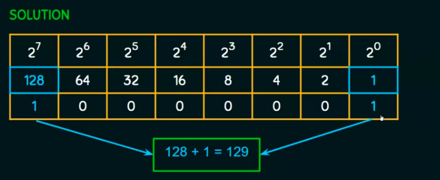

	- Para representar um binário com valor máximo de 255, é necessário 8 bits.
	- Cada bit na cadeia do octeto representa os seguintes valores:

	128	64	32	16	8	4	2	1

	- Note que começando do 1 a esquerda, o valor a esquerda é sempre igual duas vezes o valor da direita.
	- Note também que a soma dos valores é igual a 255.

	O valor em decimal é igual a soma dos valores dos bits com sinal 1.

	Exemplo: IP: 10.20.12.45
	
	10:	128	64	32	16	8	4	2	1
		0	0	0	0	1	0	1	0
		8 + 2 = 10
	20:	128	64	32	16	8	4	2	1
		0	0	0	1	0	1	0	0
		16 + 4 = 20
	12:	128	64	32	16	8	4	2	1
		0	0	0	0	1	1	0	0
		8 + 4 = 12
	45: 128	64	32	16	8	4	2	1
		0	0	1	0	1	1	0	1
		32 + 8 + 4 + 1 = 45

	IP: 00001010.00010100.00001100.00101101

#### Quantos bits são utilizados para representar a rede[/24]

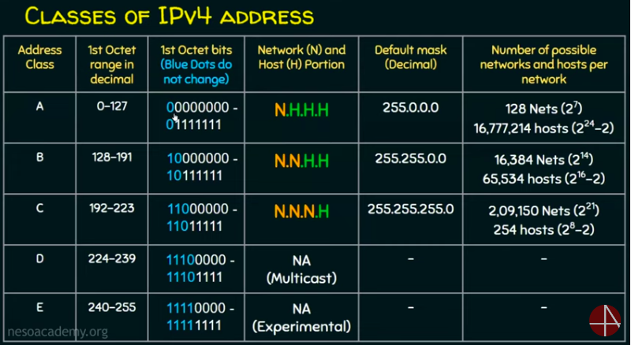

	Quando o barra não esta representado no IP, o valor é 24.
	O número que esta após o barra no endereço de 
	IP significa o número de bits utilizados para representar a rede. O restante representa o número de hosts para cada rede.

	Exemplo: 	 
				 IP: 10.20.12.45/25
		 		 IP: 00001010.00010100.00001100.0	0101101
	máscara de rede: 11111111.11111111.11111111.1 0000000

	O número total de hosts por rede:
	2^(bits) - 2
	2 ^(7) - 2 =  126

	Total de Sub-redes:
	1) SUB-REDE		10.20.12.0	BROADCAST	10.20.12.127
	2)SUB-REDE		10.20.12.128	BROADCAST	10.20.12.255

#### Máscara de Rede

				 IP: 10.20.12.45/26
		 		 IP: 00001010.00010100.00001100.00101101
	
	máscara de rede: 11111111.11111111.11111111.11000000
	- 1 representa os bits destinados a rede
	- 0 representa os bits destidanos aos hosts
	máscara de rede: 255.255.255.192

#### Classes de Rede

	Classe A	10.0.0.0 à 10.255.255.255
	REDE	HOSTS
	 x		y z w
	
	Classe B	128.0.0.0 à 191.255.255.255
	REDE	HOSTS
	 x y	 z w
	
	Classe C	192.0.0.0 à 223.255.255.255
	REDE	HOSTS
	x y z	  w

### Roteamento

	Switch - Conexão entre computadores da mesma rede
	Roteador - Conexão entre redes.

	Para fazer o direcionamento dos pacotes de uma rede para outra, o roteador analisa seus cabeçalhos IP e consulta a rota para a rede de destino em sua tabela de roteamento.

	Roteamento é o conjunto de regras que definem como dados originados em uma determinada rede devem alcançar uma rede distinta.

	O papel do roteador é conhecer os caminhos para as diversas redes e saber como implementar o processo de roteamento.

	- Endereço IP da rede destino
	- Endereço IP do roteador vizinho.
 

	O roteador deve aprender sobre rotas para redes remotas (que não estão diretamente ligadas a ele).

	As melhores rotas para se chegar a uma determinada rede, são armazenadas em uma tabela, chamada tabela de roteamento.
	O termo "Distância Administrativa" (ADs) são usados para classificar a confiabilidade das rotas recebidas ou configuradas.

	| Origem da Rota					| AD (Confiabilidade)	|
	|-----------------------------------------------------------|
	| Rotas diretamente conectada		|			0			|
	| Rota estática						|			1			|
	| EIGRP								|			90			|
	| OSPF								|			110			|
	 RIP								|			120			|

	O menor AD sempre será considerado como melhor caminho.

#### Roteamento Estático

	Consiste na configuração manual dos routers pelo administrador da rede.

	Vantagens:
	- Menor consumo de memória e CPU no roteador
	- Não há utilização de largura de banda para troca de informações de roteamento entre os roteadores ( os roteadores não precisam ficar conversando entre si, já esta tudo configurado manualmente).
	- Maior controle da rede

	Desvantagens:
	- O administrador precisa, efetivamente, possuir um profundo conhecimento da rede como um todo
	- Para cada nova rede adicionada, o administrador deve, manualmente, adicionar uma rota para a mesma em cada um dos routers pertinentes.
	Inviável en redes de grande porte.

	

	O roteador quebra o dominio de broadcast.

## Fundamentals

### Definnition
	A computer network is a set of nodes connected by communication links.
	A node can be a computer, printer or any other device capable of sending/receiving data generated by other nodes in the network.
	example: computer, server, printer, security camera, routers, switches, etc...
	A computer network is mainly use for resource sharing.

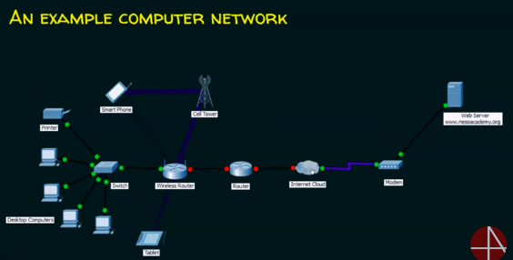

	A communication link can be a wired link or wireless link. The link carries the information.
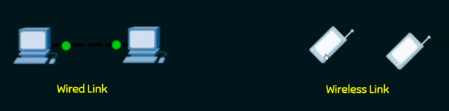

|	END DEVICES		|	INTERMEDIARY DEVICES	|
|-----------------------------------------------|
|		PC			|		Router				|
|		Printer		|		Wireless Router		|
|		Server		|		Cell Tower			|
|		Tablet		|		Modem				|
|	Smart Phhone	|		Internet Cloud		|
|-----------------------------------------------|

### Basic Caracteristics

**Fault Tolerance**

	The ability to:
	1. Continue working despite failures.
	2. Ensure no loss of service.
	This means that is necessary redundance of nodes and medium. So in case of a node or medium falure, the other can do the job and the network do not fail.
	
**Scalability**

	The ability to:
	1. Grow based on the needs.
	2. Have good performance after growth.

**Quality of Service (QoS)**

	The ability to:
	1. Set priorities.
	2. Manage data traffic to reduce data loss, delay, etc... .

**Security**

	The ability to prevent:
	1. Unauthorized access
	2. Misuse
	3. Forgery

	The abilityto provide:
	1. Confidenciality
	2. Integrity
	3. Avaiability

### Data Communication

	It's the exchange of data between two nodes via some form of link such as a cable.

**Data Flow**

	Simplex: One device can transmit and the other device will receive.
		Example: keyborad, tradicional monitors, etc... .

	Half Duplex: Communication is in both directions but not at the same time. If one device is sending, the other can only receive, and vice versa.
	Example: Walkie-Talkies

	Full Duplex: Communication is in both directions simultaneously. Device can send and receive data at the same time.
	Example: telephone line.

**Protocols**

	All communication schemes wil have the following things in common:
	- Source or Sender
	- Destination or Receiver
	- Channel or Media
	Rules or protocols govern all methods of communication.
	
	Protocols determines:
	- What is communicated?
	- How it is communicated?
	- When is communicated?

	Elements of a protocol are:
	- Message encoding
		a. Source generates a message
		b. The Encoder will convert the message into signals (that suits the kind of transmission).
		c. Transmission (can be wired or wireless)
		d. Receiver will receive the data.
		e. Decoder will decode the signal (understand the signal).
		f. Message is received by de destination.
	- Message formatting and encapsulation
		a. Agreed format.
		b. Encapsulate the information to identify the sender and the receiver rightly (IP address).
	- Message size
		Longmessages must be broken into smaller pieces to travel across a network.
	- Message timing
		a. Flow control. (Imagine a sender is faster than a receiver. Before the sender starts to send, the receiver will tell him how many packes per second he can receives).
		b. Response timeout.
	- Message delivery options
		a. Unicast: One sender / one receiver
		b. Multcast: One sender / mult receivers, but not all
		c. Broadcast: One sender / all receivers

Netwok Types

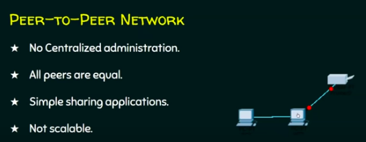
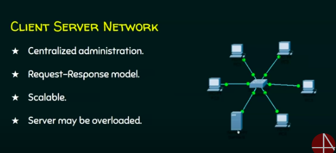

### Components

#### Nodes

	It's a device that can send / receive data.
	Can be:
	End node - The start or the end point of a communication.
		example: computers, network printers, security cameras, smart phones, barcode scanner, etc... .
	Intermadiary node - Foward the data from one node to another.
		example: switches, wireless access point, routers, bridges, hubs, repeaters, cell tower, etc... .

#### Media (link)

	Wired medium (guided medium)
		example: ethernet crossover cable, fiber optic cable, coaxial cable, USB cable
	Wireless medium (unguided medium)
		example: infrared, radio, microwaves, satellite

#### Services

	e-mail, storage services, file sharing, instant messaging, online game, voice over IP, word wide web

### Classification of Computer Network

**1. Local Area Network (LAN)**
	A LAN is a computer network that interconnects computers within a limited area such as residance, school, laboratory, ofice building, university campus, etc... .

	LAN-DEVICES
	- Wired LAN ( Ethernet- Hub, switch)
	- Wireless (WIFI)

**2. Metropolitan Area Network (MAN)**
	A MAN is a computer network that interconnects users with computer resources in a geographic region of the size of a metropolitan area (city). In other words it is a connecton among LANs in a city.
	MAN-DEVICES
	- Switches / Hub to LAN
	- Routers / Bridges - Connect LANs

**3. Wide Area Network (WAN)**
	A WAN is a telecommunication network that extends over a large geographical area for the primary purpose of computer networking. In other words it is a connection among MANs.
	WAN-DEVICES
	- End devices and Intermadiaries devices

**The Internet is a WAN**

### Network Topology

	Topology is the layout of the network nodes.

	a. Physical Topology
		Placement of various nodes.
	b. Logical Topology
		Deals with the data flow in the network.

**BUS**

	* All data transmitted between nodes in the network is transmitted over this common transmission medium and is able to be received by all nodes in the network simultaneously.
	* A signal containing the address of the intended receiving machine travels from a source machine in both directions to all machines connected to the bus until it finds the entended recipient.

**RING**

	* A ring topology is a bus topology in a closed loop.
	Peer-to-peer LAN topology
	* Two connections: one to each of its nearest neighbors.
	* Unidirectional
	* Sending and receiving data takes place with the help of a token.

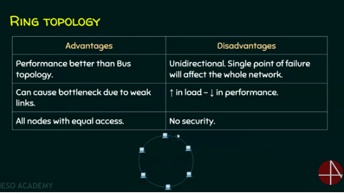

**STAR**

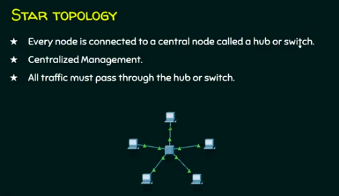

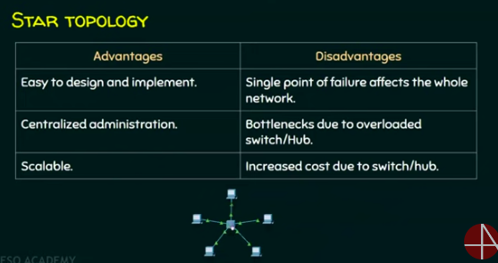
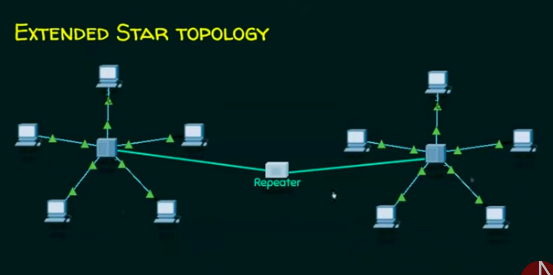

**MESH**

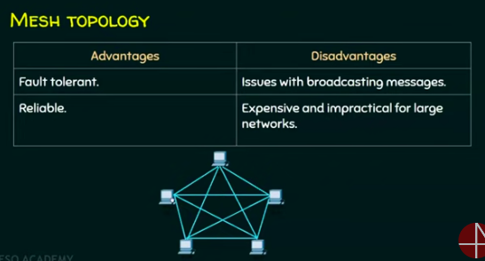

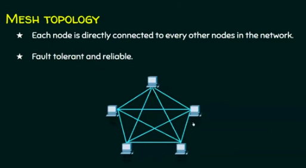

**HYBRID**

## IP Address

**Definition (IPV4)**

	- IP (Internet Protocol)
	Every node in the network is identified with a IP address.
	- Logical address
	- Canchange based on the location of the device.
	- Assigned by manually or dynamically.
	- Represented in decimal and it has 4 octets(x.x.x.x).
	- 0.0.0.0 to 255.255.255.255 (32 bits).

	* IP addresses are user by routers
	* MAC addresses are used by switches
### MAC address (Media Access Control)

	- Every node in the LAN is identified with the help of MAC address
	- Physical address or Hardware Address
	- Unique
	- Can not be changed.
	- Assigned by manufacturer.
	- Represented in hexadecimal.
		example: 70-20-84-00-ED-FC (48 bits).
	- IP address = Location of person
	- MAC address = Name of a Person
	* The location can change, the name no.

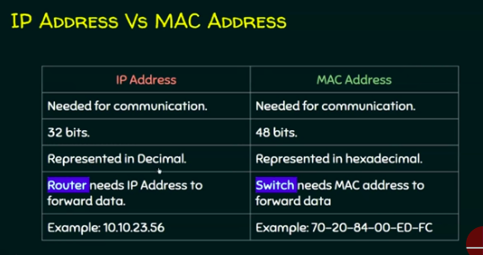

### Port Address

	IP		- Reach the network
	MAC		- Reach the host
	Port	- Reach the right process in the 

	- In a node, many process will be running
	- Data which are sent/received must reach the right process
	Every process in a node is uniquely identified using port numbers
	Port = Communication end point
	Fixed and dinamic port numbers (0 - 65535)

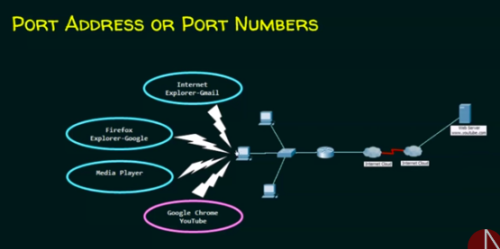

### Switching

	- Switching helps decide the best route for data transmission if the are multiple paths in a larger network
	- One to one connection

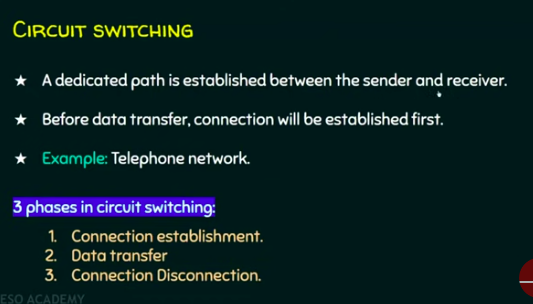

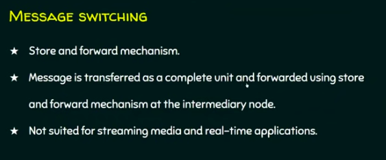

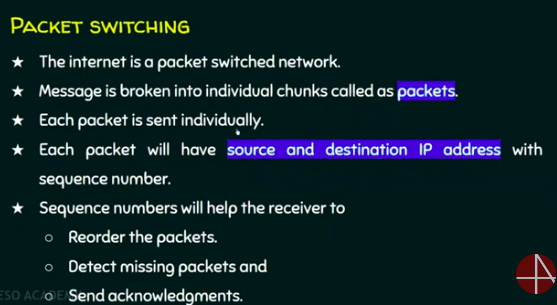

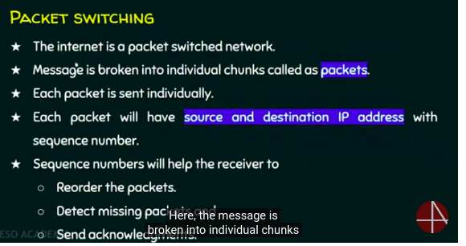

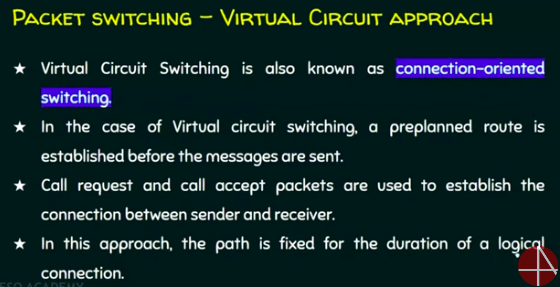

### Layer in Network

	Layering means decomposing the problem into more manageable components (Layers).

	Advantages:
	* it provides more modular design.
	* Easy to troubleshoot.

#### Protocols

	- It is a set of rules tha governs data communication
	- The protocols in each layer governs the activities of the data communication.

#### Layered Architectures

	- OSI
	- TCP/IP

**OSI [Open System Interconnection]**

	- It is a model for understanding and designing a network architecture that is flexible, roboust, and interoperable.
	- Developed by the International Standards for Organizations (ISO)
	- OSI model is not a protocol, it is a guideline.

	The purpose of the OSI model is to show how to facilitate communication between different systens without requiring changes to the logic of the underlying hardware and software
	The OSI model was never fully implemented

**TCP/IP [Transmission Control Protocol/Internet Protocol]**

	- It was developed prior to the OSI model
	- Therefore, the layers in the TCP/IP protocol suite do not exactly match those in the OSI model.
	- It is a hierarchical protocol made up of interactive modules, each of which provides a specific funcionality.

## Data Link Layer

## Network Layer

## Transport Layer

## Application Layer

Network Security
