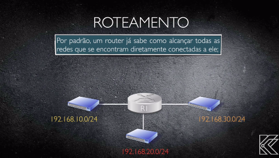

# 42_school_Net_Pratice
A system administration related exercises

### Network Protocol Layers

	- Network communication is split into layers.
	- Each layer has different protocols that operate at that layer.
	- Each layer is self-contained and only needs to know to interface with the layer above and below it.

	1) Application	[protocols: HTTP, HTTPS, DNS, SMTP, IMAP, POP]
	2) Transport	[protocols: TCP, UDP, SPX]
	3) Network	[protocols: IPv4, IPv6, ICMP]
	4) Link		[protocols: Ethernet, MAC address, network card, device drivres, WIFI standards, switches, etc...]
	5) Physical	[ethernet cables, ...]

#### Aplicação
	Essa camada é utilizada pelos programas para enviar e receber informações de outros programas através da rede. 

#### Transporte
	A camada de transporte é responsável por receber os dados enviados pelo grupo acima, verificar a integridade deles e dividi-los em pacotes.
	Feito isso, as informações são encaminhadas para a camada Network, logo abaixo dela.

#### Network
	Na Network, os dados empacotados são recebidos e anexados ao endereço virtual (IP) do computador remetente e do destinatário.
	Agora é a vez dos pacotes serem, enfim, enviados pela internet. Para isso, são passados para a camada Interface.

#### Link
	A tarefa da Interface é receber e enviar pacotes pela rede. Os protocolos utilizados nessa camada dependem do tipo de rede que está sendo utilizado. Atualmente, o mais comum é o Ethernet, disponível em diferentes velocidades.

#### Então o que é o TCP/IP
	É o conjunto de tdas a etapas citadas acima: primeiro há o recebimento das informações (camada de aplicação), depois elas são empacotadas para o formato da rede (transporte).Por fim, os dados são endereçados (rede) e enviados (interface).

## TCP/IP
	TCP significa "Transmission Control Protocol" e IP "Internet Protocol".
	Por mais que duas máquinas estejam conectadas à mesma rede, se não “falarem” a mesma língua, não há como estabelecer uma comunicação. Então, o TCP/IP é uma espécie de idioma que permite às aplicações conversarem entre si.

### Rede IP Máscara e Gateway

### Cálculo Sub-rede

#### Número IPV4
	
	- O número IP é composto por 32 bits ou 4 octetos.

	00000000.00000000.00000000.00000000

	Cada octeto é representado por um decimal que vai de 0 a 255.
	- O formato decimal é utilizado para representar de uma maneira que fique mais fácil de ler.
	- O computador utiliza o sistema binário.

#### Converter Decimal para Binário
	
	- Para representar um binário com valor máximo de 255, é necessário 8 bits.
	- Cada bit na cadeia do octeto representa os seguintes valores:

	128	64	32	16	8	4	2	1

	- Note que começando do 1 a esquerda, o valor a esquerda é sempre igual duas vezes o valor da direita.
	- Note também que a soma dos valores é igual a 255.

	O valor em decimal é igual a soma dos valores dos bits com sinal 1.

	Exemplo: IP: 10.20.12.45
	
	10:	128	64	32	16	8	4	2	1
		0	0	0	0	1	0	1	0
		8 + 2 = 10
	20:	128	64	32	16	8	4	2	1
		0	0	0	1	0	1	0	0
		16 + 4 = 20
	12:	128	64	32	16	8	4	2	1
		0	0	0	0	1	1	0	0
		8 + 4 = 12
	45: 128	64	32	16	8	4	2	1
		0	0	1	0	1	1	0	1
		32 + 8 + 4 + 1 = 45

	IP: 00001010.00010100.00001100.00101101

#### Quantos bits são utilizados para representar a rede[/24]

	Quando o barra não esta representado no IP, o valor é 24.
	O número que esta após o barra no endereço de 
	IP significa o número de bits utilizados para representar a rede. O restante representa o número de hosts para cada rede.

	Exemplo: 	 
				 IP: 10.20.12.45/25
		 		 IP: 00001010.00010100.00001100.0	0101101
	máscara de rede: 11111111.11111111.11111111.1 0000000

	O número total de hosts por rede:
	2^(bits) - 2
	2 ^(7) - 2 =  126

	Total de Sub-redes:
	1) SUB-REDE		10.20.12.0	BROADCAST	10.20.12.127
	2)SUB-REDE		10.20.12.128	BROADCAST	10.20.12.255

#### Máscara de Rede

				 IP: 10.20.12.45/26
		 		 IP: 00001010.00010100.00001100.00101101
	
	máscara de rede: 11111111.11111111.11111111.11000000
	- 1 representa os bits destinados a rede
	- 0 representa os bits destidanos aos hosts
	máscara de rede: 255.255.255.192

#### Classes de Rede

	Classe A	10.0.0.0 à 10.255.255.255
	REDE	HOSTS
	 x		y z w
	
	Classe B	128.0.0.0 à 191.255.255.255
	REDE	HOSTS
	 x y	 z w
	
	Classe C	192.0.0.0 à 223.255.255.255
	REDE	HOSTS
	x y z	  w

### Roteamento

	Switch - Conexão entre computadores da mesma rede
	Roteador - Conexão entre redes.

	Para fazer o direcionamento dos pacotes de uma rede para outra, o roteador analisa seus cabeçalhos IP e consulta a rota para a rede de destino em sua tabela de roteamento.

	Roteamento é o conjunto de regras que definem como dados originados em uma determinada rede devem alcançar uma rede distinta.

	O papel do roteador é conhecer os caminhos para as diversas redes e saber como implementar o processo de roteamento.

	- Endereço IP da rede destino
	- Endereço IP do roteador vizinho.
 

	O roteador deve aprender sobre rotas para redes remotas (que não estão diretamente ligadas a ele).

	As melhores rotas para se chegar a uma determinada rede, são armazenadas em uma tabela, chamada tabela de roteamento.
O termo "Distância Administrativa" (ADs) são usados para classificar a confiabilidade das rotas recebidas ou configuradas.

	O roteador quebra o dominio de broadcast.
